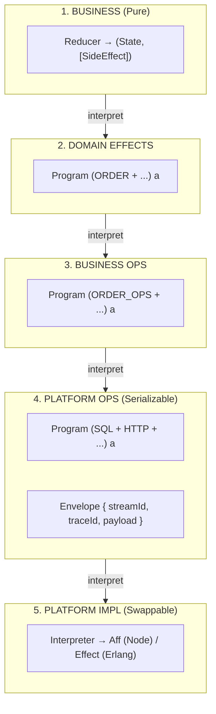

<project>
# purescript-flow

Platform-agnostic workflow composition library for PureScript.

## Core Type

```purescript
Workflow i o a b
--        | | | +-- b: output value (workflow ends with)
--        | | +---- a: input value (workflow starts with)
--        | +------ o: output messages (requests workflow SENDS) - row type
--        +-------- i: input messages (responses workflow RECEIVES) - row type
```

## Key Features

- **Inspectable**: Workflows are data, enabling diagram generation
- **Composable**: Category, Profunctor, Strong, Choice instances
- **Platform-agnostic**: No Effect/Aff imports; interpretation at edges
- **Type-safe**: Row polymorphism for effect composition

## No FFI Policy

This library is pure PureScript. No `.js` or `.erl` files are allowed in `src/`.
Platform-specific interpreters belong in consumer projects.

</project>
<guidance>
<general>
# General Rules

## Resources

- GitHub: https://github.com/Cambridge-Vision-Technology
- FlakeHub: https://flakehub.com/flake/Cambridge-Vision-Technology

## Core Principles

- Brutal honesty: call out bad ideas early
- Delete code; don't comment out (git has history)
- Fail fast: crash on missing inputs; no fallbacks/empty catches. Use `set -euo pipefail` and `${VAR:?error}`
- Search codebase before creating new code
- Convention over configuration: sensible defaults for naming/structure
- Document technical debt with remediation plan

## Design & Types

- Prefer Either/Maybe/Result over exceptions
- Make invalid states unrepresentable
- Parse at boundaries; enforce invariants via types
- Effects at edges; pure core
- Immutability; DRY; single responsibility
- Prefer functional + statically typed languages

## Environment Detection

Use `*_ENV` variable (required, no default) for environment selection:
- Valid values: `production`, `development`, `ci`
- DevShell automatically sets development environment
- CI workflows explicitly set CI environment

## Configuration

Configs are **independent of environments**. They define application settings (service URLs, feature flags, etc.), not where code runs.

**Three distinct concepts:**
- **Environment** — WHERE code runs (production, CI, development). Detected via `*_ENV`.
- **Config** — WHAT settings to use (live services vs test services). Bundled with app, copied to working directory.
- **Secrets** — Credentials loaded via SOPS based on environment.

**Config approach:**
- Apps bundle pre-made configs (e.g., `config.live.toml`, `config.test.toml`)
- App errors on startup if no config file in working directory
- `myapp config <name>` copies bundled config to working directory
- Users can edit the copied config freely

**Environment + Config combinations:**
| Environment | Typical Configs | Notes |
|-------------|-----------------|-------|
| development | live, test | Developer choice; may test against either |
| ci | test only | Never run CI against live services |
| production | live only | Production always uses live config |

**Test derivations:**
- Test derivations explicitly set up the test config at start
- Creates temp directory, runs `config test` (or copies pre-made test config)
- Nix derivation isolation prevents tests from using developer's local config
- Even with live config on disk, `nix run .#test-*` uses test config

This defense-in-depth approach prevents accidental test runs against live systems.

## Testing

- Verify outcomes/effects, not "didn't crash"
- Never generate expected values; compare to fixtures/constants
- **Isolate fixtures per feature**: `test/fixtures/<feature>/`. Never share fixtures across features

## Hygiene

- No comments; use meaningful names (EXCEPTION: `-- NOTE:` for non-obvious design decisions that could be mistaken for bugs)
- No hard-coded paths
- Write outputs to `out/<command>/…`
- Stage before builds: `git add -A` before `nix build`/`nix flake check`
- Include empty dirs via `.gitkeep`
- Avoid env vars; use explicit CLI args
- Improve guidance when you learn something

## Context Management (Claude Code)

Limited context. Verbose output can exhaust it.

**High-risk**: test recording, verbose tests, build logs, API dumps.

**Rules:**
- Limit output: `| tail -50` or `| head -100`
- Check results via files, not stdout
- Use exit status: `&& echo "✅" || echo "❌"`
- Never expand large outputs (+10000 lines)
- Background tasks: verify via exit code/files, not buffered output

## Versioning

- No backward-compat shims unless requested; breaking changes OK
- Tools via `flake.nix`; run `nix flake check` or `nix run .#format-fix`
- No code in planning docs; no docs unless requested

## Commits

- Conventional Commits: `type(scope)!: short imperative summary`
- Types: `feat`, `fix`, `docs`, `style`, `refactor`, `perf`, `test`, `build`, `ci`, `chore`, `revert`
- Subject ≤72 chars, imperative, no period
- Body: why/how, ~72 char wrap
- Footer: `BREAKING CHANGE: …` and `Refs: #123`/`Closes: #123`
- Small, focused commits

## Git Strategy

- Rebase-only: "Rebase and merge"; no merge commits to `main`
- Linear history: rebase on `origin/main`; push `--force-with-lease`
- Protect `main`: no direct pushes; CI required
- Small PRs, ≥1 approval, resolve conversations before merge

### Merge & Rebase Safety (CRITICAL)

**NEVER stash/merge/unstash.** Can silently overwrite work:
```bash
# DANGEROUS
git stash && git rebase origin/main && git stash pop
```

**Gotchas:**
- `--ours`/`--theirs` SWAPPED during rebase: `--ours` = main, `--theirs` = your changes
- `git diff origin/main..HEAD`: `-` = main, `+` = yours
- Run `git diff origin/main..HEAD --name-only` before push to verify changed files

**Conflict resolution:**
1. Commit or discard first — never stash
2. Resolve file by file: `git status` → `git diff <file>` → edit → `git add <file>`
3. **NEVER**: `git checkout --theirs .` / `git checkout --ours .` / blind `git add -A`
4. Review every hunk — both sides changed the code
5. Complex merges: `git merge --no-commit origin/main` then review
6. Confused? `git rebase --abort` / `git merge --abort` — never guess
7. Build/test after resolution
8. Verify diff only touches your files

**Workflow:**
1. Feature branch → work → open PR early
2. `nix flake check`
3. Commit changes
4. Squash local commits into one
5. Rebase on `origin/main`
6. `nix flake check` again
7. `git push --force-with-lease`
8. Wait for CI
9. "Rebase and merge" on GitHub

**CRITICAL**: Squash and rebase are SEPARATE. Never `git reset --soft origin/main`.

**CRITICAL**: NEVER rewrite history (e.g., LFS pointers). Admin only.
</general>
<nix>
# Nix

Determinate Nix flakes. All dev/build/test in `flake.nix` only.

## Commands

- `nix flake check`: lint, format, build, playback tests
- `nix build .#<pkg>`: specific package
- `nix run`: production app
- `nix run .#dev`: dev server
- Tests: `.#test-playback` (pure), `.#test-live`, `.#test-record`

## Rules

- Single source of truth: `flake.nix` only (no Makefile/package.json scripts)
- Ecosystem integrations: purs-nix, uv2nix, buildNpmPackage
- No network in builds; network only in `nix run` apps
- Split deps: `deps` (all) and `deps-prod` (runtime via `--omit=dev`)
- Hash deps: `nix run nixpkgs#prefetch-npm-deps -- package-lock.json`
- Monolithic source via `pkgs.lib.fileset`
- Fail fast: no fallbacks
- CI builds from tracked files only
- Symlink read-only; copy when modifying. Never mutate outputs
- Output to `out/<command>/…`

## Flake Inputs

- Company FlakeHub: https://flakehub.com/flake/Cambridge-Vision-Technology
- **Always FlakeHub** for internal projects — CI lacks GitHub access
- Syntax: `flakehub:Cambridge-Vision-Technology/repo/*`

## Staging & Store

- Nix includes only **tracked** (staged/committed) files — untracked files are invisible
- For tracked files, Nix reads **working tree content** including unstaged modifications
- `git add` new files before `nix build`/`nix flake check` (existing tracked files need no re-staging)
- Missing staging symptoms: new file can't be found, "works locally" but CI fails
- Empty dirs: add `.gitkeep`
- nix NEVER has cache invalidation issues itself, if you think the nix cache is not picking up your changes, think again you have done something wrong.

## Linux Builder (macOS)

Determinate Nix includes Linux builder — build `x86_64-linux`/`aarch64-linux` without VM:
```bash
nix build .#packages.x86_64-linux.<pkg>
```

## Package Model

- Internal: `source`, `deps`, `deps-prod`, `test-harness`
- Exposed: `lint`, `format`, `build`, `dev`
- Checks: `lint`, `format`, `build`, `test-playback`
- Apps: `default`, `dev`, `test-live`, `test-record`, `test-playback`, `format-fix`

## Tests

- Playback pure: `nix flake check`
- Live/record: `nix run .#test-live|.#test-record -- [args]`
- Recording only for API calls — only side effects not reproducible in sandbox
- Isolate fixtures per feature: `test/fixtures/<feature>/`

## Updates

Automate with update-flake-lock (weekly PRs).
</nix>
<purescript>
# PureScript

## Setup

- purs-nix for builds (NEVER spago)
- purs-tidy for formatting
- Linting: Cambridge-Vision-Technology/purescript-whine
- Duplicate detection: Cambridge-Vision-Technology/purescript-dedup
- Unused functions: Cambridge-Vision-Technology/purescript-scythe (note: `*TestRunner.purs` are entry points, not unused)
- Reimplementation detection: Cambridge-Vision-Technology/purescript-drop

## FFI

- Never import FFI as pure (JS can throw). Use `EffectFn*` + `runEffectFn*`
- **JS FFI = thin stubs only**: call external libs, perform I/O
- **Never in JS FFI**: data transforms, business logic, string formatting
- Avoid `Foreign`; model concrete types

## FFI (CRITICAL)

**JS FFI = thin stubs only. No logic, transforms, or string manipulation.**

### EffectFn vs Curried Effect

| Pattern               | JS Signature                   | PS Type                | Use         |
| --------------------- | ------------------------------ | ---------------------- | ----------- |
| EffectFn* (preferred) | `(a, b) => result`           | `EffectFn2 A B R`    | Always      |
| Curried Effect        | `(a) => (b) => () => result` | `A -> B -> Effect R` | Legacy only |

**Thunk `() =>` only for curried Effect, NOT EffectFn.**

```javascript
// CORRECT: EffectFn - NO thunk
export const setAuthor = (doc, author) => doc.setAuthor(author);

// WRONG: Thunk with EffectFn - effect never runs!
export const bad = (a, b) => () => doSomething(a, b);
```

```purescript
foreign import setAuthorImpl :: EffectFn2 Doc String Unit
setAuthor :: Doc -> String -> Effect Unit
setAuthor = runEffectFn2 setAuthorImpl
```

### FFI Rules

- **Never pure imports** — JS can throw. Always `EffectFn*` + `runEffectFn*`
- **Object methods**: `(obj, arg) => obj.method(arg)`
- **Promises**: Return `Effect (Promise a)`, convert via `Control.Promise.toAff`
- **All logic in PureScript** — if expressible in PS, it must be
- **Impl suffix** — name FFI with `Impl`, wrap with cleaner PS API

### Forbidden in JS FFI

```javascript
// BAD: local imports
import { helper } from "../../js/tool.js";
// BAD: transforms
export const format = (fields) => fields.map(f => f.name).join("\n");
// BAD: string manipulation
export const buildPath = (dir, file) => `${dir}/${file}`;
// BAD: business logic
export const validate = (x) => x.length > 0 && x.length < 100;
```

## Data Modeling

- **ADTs over strings**: known options = sum type, not String
- Red flag: `case str of "foo" -> …` — use `data Foo = Foo | Bar`
- Strings for user-facing text, not control flow

### Semantic Newtypes over Primitives

Prefer specific newtypes over raw `String`, `Int`, `Number`:

| Instead of        | Use                     |
| ----------------- | ----------------------- |
| `String` (path) | `Path`, `FilePath`  |
| `Int` (pixels)  | `Pixels`, `Width`   |
| `Int` (ID)      | `UserId`, `OrderId` |

**Principle**: If two values share a primitive type but have different meanings, create distinct newtypes. Compiler catches misuse; readers understand intent.

## Error Handling

Use Either/Maybe; never throw/unsafe.

## Imports

- Qualified: `import Data.Maybe as Data.Maybe`
- Fully qualified names: `Data.Maybe.fromMaybe`
- Exceptions: Prelude and explicit symbols

## JSON Serialization

Use **wire types** separate from domain types.

### Discriminated Unions → ADTs

```purescript
-- GOOD: ADT wire type
data DocumentJson
  = FormJson { formType :: FormTypeJson }
  | LegalJson
derive instance Generic DocumentJson _

-- BAD: Flat record with nulls
type DocumentJson = { type :: String, formType :: Nullable FormTypeJson }
```

### Rules

- Avoid custom encode/decode — use `genericEncodeJson`/`genericDecodeJson`
- ADTs for unions; `Nullable`/`Maybe` for optional fields
- `.:?` handles missing fields AND explicit null

## Safety

Ban: `Partial`, `unsafePartial`, `unsafeCoerce`, `unsafePerformEffect`, `unsafePerformAff`, `crashWith`.

Use newtypes to prevent primitive misuse:

- Always derive `Newtype`: `derive instance Data.Newtype.Newtype MyType _`
- Prefer `unwrap`/`wrap` over custom accessors
- Export smart constructors when validation needed

## Debugging

- Type holes (`?placeholder`) — one per compile
- `purescript-debug`: `spy`, `spyWith` — dev only, remove before prod

## Libraries

- Pursuit for search
- Key: Argonaut (JSON), Affjax (HTTP), aff, js-promise-aff, effect, run, Halogen

## Nix

purs-nix for builds; purescript-overlay for tooling. No spago.

## Effects & Testing

- Type classes per effect. Use transformers or Run. See `testing.md`
- **NEVER** `liftEffect`/`liftAff` except in interpreters — create Capability or Run effect
- **NEVER** `MonadEffect`/`MonadAff` in final tagless stack
- Capabilities should return Either — FFI can throw

## Effect Architecture

Layered architecture for platform independence, testability via recording/playback, and external test harnesses. ALL effects, no exceptions go though the test harness and are recorded.



**SideEffects → Program**: The reducer returns SideEffects as data. A runtime loop interprets each SideEffect by invoking the corresponding `Program r a` computation.

### 1. Business Layer (Pure Reducer)

State machine with effects as data. App state machine **composes smaller state machines** — business objects are also state machines with domain events.

**Messages = Domain Events (DDD)**: Abstract business occurrences, not implementation details.

```purescript
-- Messages = Domain Events
data Message
  = RecordFound { timestamp :: Timestamp, clientId :: ClientId, data :: RecordData }
  | ProcessingFailed { timestamp :: Timestamp, clientId :: ClientId, error :: String }

-- SideEffects = Actions to take
data SideEffect = PersistState | NotifyExternal { endpoint :: String, payload :: Json }

-- Pure reducer
update :: State -> Message -> Tuple State (Array SideEffect)
```

**Rules**: Reducer pure; messages carry ALL context (including timestamp); compose state machines.

### 2-3. Effect Layers (Domain → Business Ops)

Use `purescript-parallel-effects`. Applicative = parallel; Monadic = sequential.

```purescript
import Type.Row (type (+))  -- Row composition operator

-- Domain effect (abstract, business-speak)
data OrderF a = SubmitOrder Order (Either OrderError OrderId -> a)
type ORDER r = (order :: OrderF | r)

-- Business ops effect (granular operations)
data OrderOpsF a = CheckExisting CustomerId (Either DbError (Maybe Order) -> a)
                 | SaveOrder Order (Either DbError OrderId -> a)
type ORDER_OPS r = (orderOps :: OrderOpsF | r)

-- Interpret domain → business ops
runOrder :: forall r. Program (ORDER + r) a -> Program (ORDER_OPS + r) a
```

**Rules**: `Program r a` from parallel-effects; ALL effects return Either; Applicative (`<*>`) = parallel.

### 4. Platform Ops (Serializable Boundary)

Raw I/O effects wrapped in envelopes for recording/replay. Future: `purescript-envelope` library.

```purescript
-- Platform ops (recordable)
data SqlF a = Query String (Array SqlParam) (Either SqlError SqlResult -> a)
data HttpF a = Request HttpReq (Either HttpError HttpResp -> a)
type SQL r = (sql :: SqlF | r)

-- Envelope for serialization
data RequestPayload
  = RequestPayloadHTTP { method :: String, url :: String, body :: Json }
  | RequestPayloadSQL { query :: String, params :: Array SqlParam }

type Envelope a = { streamId :: StreamId, traceId :: TraceId, timestamp :: String, payload :: a }

-- Generic codecs only
derive instance Generic RequestPayload _
instance EncodeJson RequestPayload where encodeJson = genericEncodeJson

-- Interpret business ops → platform ops
runOrderOps :: forall r. Program (ORDER_OPS + r) a -> Program (SQL + r) a
```

**Recording happens here** — Platform Ops are the serializable boundary.

### 5. Platform Impl (Swappable)

One interpreter per platform. Target monad depends on platform:

- **Node.js**: Interpret into `Aff` (async via fibers)
- **Erlang/purerl**: Interpret into `Effect` (concurrency via OTP processes)

```purescript
-- Node.js: Aff for async
runSqlNode :: Program (SQL + ()) a -> Aff a
runSqlNode = runParallel (on _sql interpretSqlNode $ case_)

interpretSqlNode :: SqlF ~> Aff
interpretSqlNode (Query sql params k) = do
  result <- attempt $ Pg.query sql params
  pure $ k (lmap toSqlError result)

-- Erlang/purerl: Effect (no Aff available)
interpretSqlErl :: SqlF ~> Effect
interpretSqlErl (Query sql params k) = do
  result <- Epgsql.query sql params
  pure $ k (lmap toSqlError result)
```

**Note**: `purescript-parallel-effects` uses `Aff` internally. For purerl, you may need to interpret `Program` differently or use Effect-based composition.

### Recording/Playback

Intercept at Platform Ops layer (layer 4), match by payload content (not IDs), translate IDs on replay.

### Migration Lessons (JS → Erlang)

| Issue                           | Fix                                                         |
| ------------------------------- | ----------------------------------------------------------- |
| BDD tests coupled to backend    | Use file assertions + subprocess, not compiled code imports |
| Wire types with nullable fields | ADTs with generic codecs for unions                         |
| `liftEffect` in GenServer     | OK for infrastructure; business logic through capabilities  |
| FFI scattered                   | ALL FFI in `Platform.<runtime>.*` modules                 |


### Anti-Patterns

| Bad                                    | Good                                   |
| -------------------------------------- | -------------------------------------- |
| `liftEffect`/`liftAff` in business | Capability ADT + interpreter           |             |
| Effects hide errors                    | Effects return `Either Error Result` |
| Raw `Run`/`VariantF`               | `Program` from parallel-effects      |
| FFI in domain modules                  | FFI in `Platform.*` only             |
| Flat records with nullables            | ADTs for discriminated unions          |
</purescript>
</guidance>
This file is generated, do not edit it directly. Edit either the project specific information in [agents.yaml](./agents.yaml) or the [company guidance](https://github.com/Cambridge-Vision-Technology/agen/wiki) and then rerun `agen`
To install the agen tool `nix profile add github:Cambridge-Vision-Technology/agen`

This file is generated, do not edit it directly. Edit either the project specific information in [agents.yml](./agents.yml) or the [company guidance](https://github.com/Cambridge-Vision-Technology/agen/wiki) and then rerun `agen`
To install the agen tool `nix profile add github:Cambridge-Vision-Technology/agen`