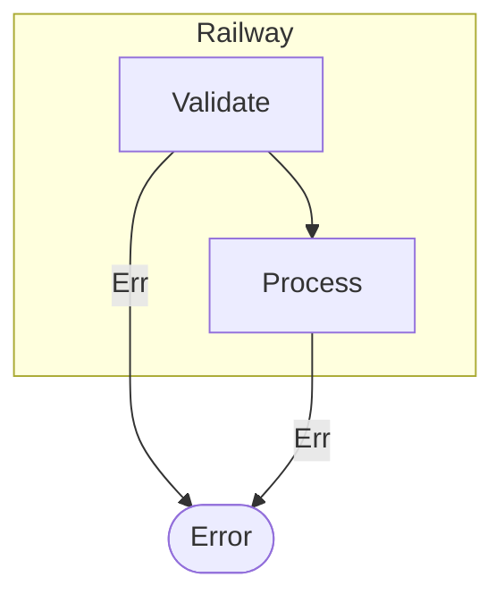
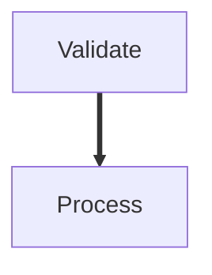

# Issue #12: Render Kleisli composition as thick arrows instead of subgraph

## Problem

The Railway constructor renders `composeK` chains as a subgraph with error rails:

This exposes the internals of Kleisli composition. The user cares about "these steps
are composed monadically" -- not the plumbing.

## Target

Render `composeK` chains as thick arrows (`==>`) between nodes:

## What does NOT change

- `Flow.Types` -- Railway constructor, RailwayCPS, mkRailway unchanged
- `Flow.Core` -- `composeK` API unchanged
- `Flow.Interpret.Effect` -- Railway execution unchanged
- All Railway execution tests remain as-is

## Tasks

### Task 1: Write failing BDD tests for thick arrow rendering

- [ ] Update `test/Test/Railway.purs` diagram tests

| Scenario | What it checks |
|---|---|
| 2-step composeK | `N0 ==> N1` -- no subgraph, no error node |
| 3-step right-nested | Flattened: `N0 ==> N1`, `N1 ==> N2` -- no subgraph |
| 3-step left-nested | Identical output to right-nested |
| Railway inside encap | Thick arrows inside encapsulation subgraph |
| Railway with timeout | Thick arrows inside timeout subgraph |
| Mixed composition | Thin `-->` for seq, thick `==>` for railway |

Verification: All new tests FAIL before implementation (red phase).

### Task 2: Update diagram renderer

- [ ] Modify `src/Flow/Interpret/Diagram.purs`
  - Change `processRailwayCPS` to emit `==>` edges instead of subgraph + error rails
  - Keep existing `collectRailwaySteps` flattening logic
  - Add `addThickEdge` helper: `fromId <> " ==> " <> toId`
  - Remove error node and error edge generation

### Task 3: Update diagram snapshot tests

- [ ] Fix any remaining diagram tests in `test/Test/Diagram.purs` or `test/Test/EndToEnd.purs`

Verification: `nix flake check` passes (green phase).
